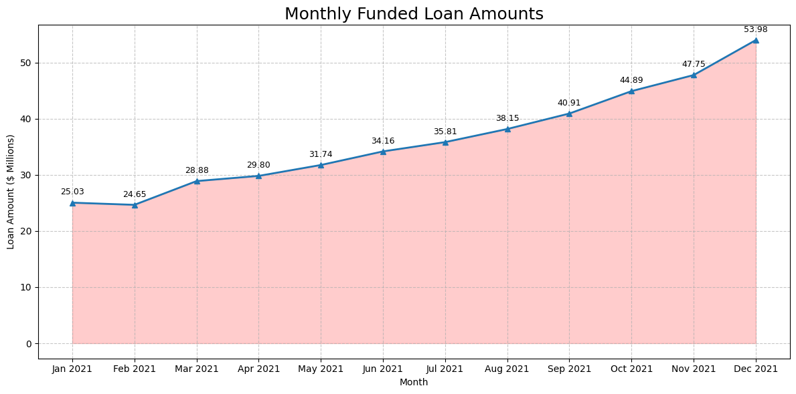
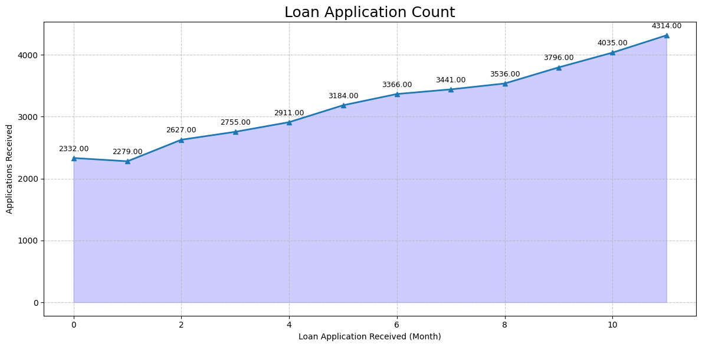

# Bank Loan Analysis Report

This repository contains a comprehensive analysis of a financial loan dataset. The project involves data cleaning, calculating key performance indicators (KPIs), and creating various visualizations to understand lending activities, loan statuses, and borrower characteristics.

---

## Project Setup

### 1. Installing Required Libraries
First, we install all the necessary Python libraries for the analysis.
```python
!pip install pandas numpy matplotlib seaborn plotly
```

### 2. Importing Libraries
Next, we import the installed libraries into our Python environment.
```python
import pandas as pd
import numpy as np
import matplotlib.pyplot as plt
import seaborn as sns
import warnings
import plotly.express as px

# Suppress warnings for a cleaner output
warnings.filterwarnings('ignore')
```

---

## Data Loading and Inspection

The dataset is loaded from an Excel file named `financial_loan.xlsx`.

```python
# Loading of data "Excel File"
df = pd.read_excel("financial_loan.xlsx")
```
> **Note:** The `df.head()` and `df.describe()` outputs would show a preview and statistical summary of the financial loan dataset here.

---

## Key Performance Indicator (KPI) Analysis

We calculated key metrics to get a high-level overview of the lending portfolio, including MTD (Month-to-Date) figures based on the latest data.

* **Total Loan Applications:** 38,577
* **MTD Loan Applications:** 4,314
* **Total Funded Amount:** $442.24 M
* **MTD Total Funded Amount:** $53.98 M
* **Total Amount Received:** $473.07 M
* **MTD Total Received Amount:** $58.15 M
* **Average Interest Rate:** 12.18 %
* **Average Debt-to-Income Ratio (DTI):** 13.43 %

---

## Good vs. Bad Loan Analysis

We classified loans to assess portfolio health:
- **Good Loans:** Loans with status `Current` or `Fully Paid`.
- **Bad Loans:** Loans with status `Charged Off`.

| Metric                  | Good Loans       | Bad Loans     |
| ----------------------- | ---------------- | ------------- |
| Application Count       | 33,061           | 5,516         |
| Percentage of Total     | 85.70 %          | 14.30 %       |
| Funded Amount           | $381.16 M        | $61.08 M      |
| Received Amount         | $450.48 M        | $22.59 M      |

---

## Data Visualization

Visual analysis to identify trends and patterns in the loan data.

### 1. Monthly Trends by Issue Date
An area chart to show trends in loan applications and funding over time.

```python
# Code for Monthly Funded Loan Amounts chart
# ... (insert the relevant Python code block here)
```



```python
# Code for Monthly Loan Application Count chart
# ... (insert the relevant Python code block here)
```



### 2. Regional Analysis by State
Horizontal bar charts to compare lending metrics across different states.

```python
# Code for Total Recovered Amount by State chart
# ... (insert the relevant Python code block here)
```


```python
# Code for Count of Fully Paid Loans by State chart
# ... (insert the relevant Python code block here)
```


### 3. Loan Term Analysis
A donut chart to show the distribution of received amounts by loan term.

```python
# Code for Total Received Amounts by Term chart
# ... (insert the relevant Python code block here)
```


### 4. Employee Length Analysis
Bar charts to analyze lending metrics based on the borrower's employment history.

```python
# Code for Total Funded Amounts by Employment Length chart
# ... (insert the relevant Python code block here)
```


```python
# Code for Total Returned Amounts by Employment Length chart
# ... (insert the relevant Python code block here)
```


### 5. Loan Purpose Breakdown
A bar chart showing the primary reasons borrowers seek financing.

```python
# Code for Total Returned Amount by Loan Purpose chart
# ... (insert the relevant Python code block here)
```


### 6. Home Ownership Analysis
Treemaps provide a hierarchical view of how home ownership status impacts loan amounts.

```python
# Code for Home Ownership by Total Funded Amount treemap
# ... (insert the relevant Python code block here)
```


```python
# Code for Home Ownership by Total Returned Amount treemap
# ... (insert the relevant Python code block here)
```

